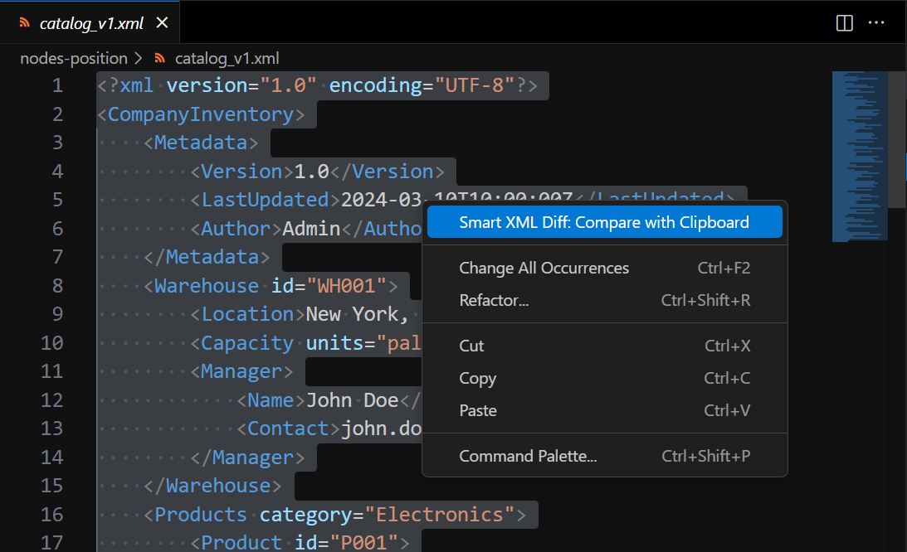
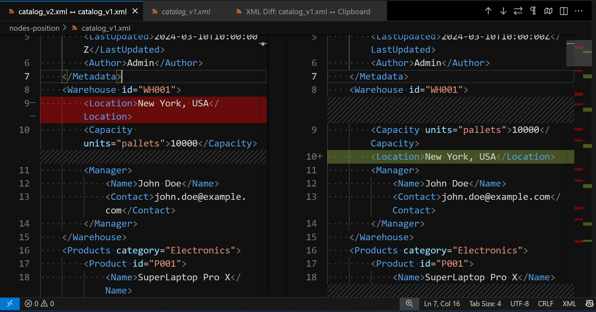
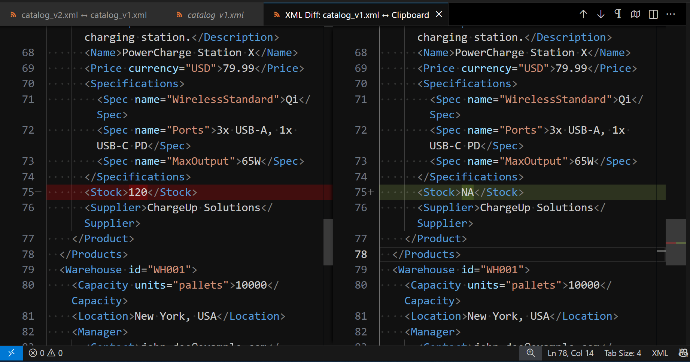

<h1 align="center">


Smart XML Diff

</h1>

<h3 align="center">Smart, noise-free XML comparison</h3>

<p align="center">
  <a href="https://marketplace.visualstudio.com/items?itemName=FrancescoAnzalone.smart-xml-diff">
    
  </a>
  <a href="https://marketplace.visualstudio.com/items?itemName=FrancescoAnzalone.smart-xml-diff">
    
  </a>
  <a href="https://marketplace.visualstudio.com/items?itemName=FrancescoAnzalone.smart-xml-diff">
  
  </a>
  <a href="https://marketplace.visualstudio.com/items?itemName=FrancescoAnzalone.smart-xml-diff">
    
  </a>
</p>

<p align="center">
  <a href="https://open-vsx.org/extension/FrancescoAnzalone/smart-xml-diff">
    
  </a>
  <a href="https://open-vsx.org/extension/FrancescoAnzalone/smart-xml-diff">
    
  </a>
  <a href="https://open-vsx.org/extension/FrancescoAnzalone/smart-xml-diff">
    
  </a>
</p>

<!-- Project meta -->
<p align="center">
  
  <a href="https://prettier.io">
    
  </a>
  <a href="https://eslint.org">
    
  </a>
</p>

<p align="center">
  <a href="#usage">Getting started</a>
  ·
  <a href="https://github.com/ai-autocoder/vscode-smart-xml-diff/issues">Report an issue</a>
</p>

---

## Table of Contents

- [Overview](#overview)
- [Key Features](#key-features)
- [When to Use This Extension](#when-to-use-this-extension)
- [Usage](#usage)
  - [Step-by-Step Workflow](#step-by-step-workflow)
  - [Commands & Shortcuts](#commands--shortcuts)
  - [Best Practices](#best-practices)
- [Configuration](#configuration)
  - [Settings Reference](#settings-reference)
  - [Example Configurations](#example-configurations)
- [Contributing](#contributing)
- [License](#license)
- [Support](#support)

---

## Overview

Smart XML Diff enhances Visual Studio Code by providing a powerful XML comparison workflow. It's specifically designed for situations where the **alphabetical order of sibling XML nodes with _different_ tag names (nodes under the same parent) is not semantically important**, while the relative order of sibling nodes with the _same_ tag name is preserved. It enables developers and XML specialists to compare selected XML (or a whole document) with clipboard content. The extension intelligently sorts distinct sibling nodes, normalizes formatting, and standardizes whitespace to highlight only meaningful differences in structure and content, significantly reducing noise from positional changes of distinct sibling types.

## Key Features

- **Context Menu Integration:** In XML files, easily compare selected XML text (or the whole document) with clipboard content via a right-click context menu action.
- **Smart Diff Algorithm:**
  - **Sorts Sibling Nodes (by distinct tag name):** Automatically sorts sibling elements with _different_ tag names alphabetically under their common parent. The relative order of sibling elements that share the _same_ tag name (e.g., a list of `<item>` elements) is preserved from the input. This helps ignore insignificant order differences between distinct types of child elements. Elements that sit next to text (mixed content, such as `<p>Hello <b>big</b> world</p>`) are never reordered.
  - **Normalizes Whitespace:** Standardizes indentation, and trims and collapses whitespace in text content and attribute values, according to configuration. Mixed content is kept on one line, with the spaces between words and elements.
  - **Sorts Attributes:** Sorts element attributes alphabetically by name, so attribute order never shows up as a difference.
  - **Ignores Comments:** XML comments are removed before comparing.
- **VS Code Diff View:** Leverages VS Code's native diff interface for a familiar and powerful comparison experience.

<p align="center">
  
</p>

### Before: Standard VS Code Diff



### After: With Smart XML Diff



## When to Use This Extension

This extension is **most effective** and **intended for use** when comparing XML documents where:

- The alphabetical order of sibling elements with _different tag names_ under the same parent node **does not affect the meaning or validity** of the XML. For example, if `<config><timeout/><retries/></config>` is semantically equivalent to `<config><retries/><timeout/></config>`.
- For sequences of elements with the _same tag name_ (e.g., a list of `<property>` elements), their relative order _is_ often important, and this extension **preserves** that relative order.
- You want to quickly find differences in element presence, attribute values, or text content, without being distracted by distinct sibling nodes simply being in a different (but semantically equivalent) order.

**Important Considerations:**

- If the order of sibling nodes _with different tag names_ is crucial for your XML's semantics (e.g., a `<header>` must appear before a `<body>` under the same parent), this tool will sort them alphabetically (e.g., `<body>` then `<header>`) and may obscure or misrepresent such order-dependent changes.
- For sequences of sibling elements _with the same tag name_ (e.g., multiple `<step>` elements in a process), their relative order is maintained from the input, so order-dependent changes within such sequences will still be visible.
- If the absolute order of _all_ sibling types is critical, a standard text diff tool might be more appropriate for those specific sections.

---

## Usage

### Step-by-Step Workflow

1.  **Open an XML file** in VS Code (or set the editor's language mode to XML).
2.  **Select** the XML element in your editor that you wish to use as the first source for comparison: a single element, with everything inside it. If no text is selected, the entire document content will be used.
3.  **Copy** the other XML content (the second source) to your system clipboard.
4.  **Right-click** on your selected text in the editor (or anywhere in the editor if no text is selected).
5.  From the context menu, choose **Smart XML Diff: Compare with Clipboard**.
6.  The extension will:
    - Parse the selected XML (or full document) and the clipboard XML.
    - Normalize both XML structures. This includes sorting sibling nodes with different tag names alphabetically, preserving the relative order of same-tagged sibling elements, sorting attributes, removing comments, and applying whitespace normalization rules.
    - Open VS Code's standard diff view, showing the normalized version of your selection/document on the left and the normalized version of the clipboard content on the right.
7.  Review the highlighted differences. These differences should primarily represent changes in content, attributes, or the presence/absence of nodes, rather than just changes in the order of distinct sibling node types.

### Commands & Shortcuts

- **Context Menu Command:** `Smart XML Diff: Compare with Clipboard` (shown in XML files; uses selection or whole document).
- **Command Palette:** Search for `Smart XML Diff: Compare with Clipboard` (this command also requires an active editor and uses selection or whole document; in a file that isn't XML it shows a warning first).
- **Keyboard Shortcut:** No default keyboard shortcut is assigned. Users can assign a custom shortcut via VS Code's "Keyboard Shortcuts" settings (`File > Preferences > Keyboard Shortcuts`) by searching for the command name.

### Best Practices

- **Understand Sorting Behavior:** Be aware that sibling elements with _different_ tag names are sorted alphabetically, by character code (so `Zebra` comes before `apple`). The relative order of sibling elements with the _same_ tag name is preserved, and so is the order of elements in mixed content. This is key to interpreting the diff correctly.
- **Select Precisely:** For focused comparisons on parts of a large document, select only the relevant XML block. This can also improve performance.
- **Valid XML:** Ensure both your selection/document and clipboard content are well-formed XML with a single root element to avoid parsing errors. Selecting several sibling elements without their common parent isn't supported and is usually reported as malformed XML, and so are attributes without a value (`<a disabled/>`).
- **Entities:** In text and attribute values, only the predefined entities (`&lt;` `&gt;` `&amp;` `&apos;` `&quot;`) and numeric character references (such as `&#160;`) are supported. Others, such as HTML's `&nbsp;`, aren't supported and are generally reported as errors. Inside CDATA sections and comments, any text is fine.
- **Processing instructions and DOCTYPE:** Processing instructions such as `<?xml-stylesheet ...?>` are kept. Their content is read as `name="value"` pairs, so other content (such as code in `<?php ... ?>`) may be shown with its spacing or `=` signs changed. The DOCTYPE isn't shown in the normalized XML, so changes to it don't show up as differences.
- **Large Files:** The selection (or the whole document when nothing is selected) and the clipboard content must each be smaller than 10MB, so a small selection of a larger document can still be compared. Large inputs can take a few seconds to normalize, and no progress indicator is shown.

---

## Configuration

### Settings Reference

All settings can be found in VS Code's settings under `Smart XML Diff`:

| Setting                                          | Default | Description                                                                                                  |
| ------------------------------------------------ | ------- | ------------------------------------------------------------------------------------------------------------ |
| `smartXmlDiff.preserveLeadingTrailingWhitespace` | `false` | Preserve leading/trailing whitespace in text nodes and attribute values.                                     |
| `smartXmlDiff.normalizeWhitespaceInTextNodes`    | `true`  | Collapse multiple spaces/tabs/newlines in text nodes and attribute values to a single space.                 |
| `smartXmlDiff.indentation`                       | `2`     | Number of spaces (0-16) to use for indentation in the normalized XML. Values outside this range are clamped. |

Whitespace between elements that contain no other text never shows up as a difference, whatever these settings: the normalized XML is always re-indented. In mixed content (text next to elements), the whitespace between words and elements is kept, and collapsed if `normalizeWhitespaceInTextNodes` is on.

### Example Configurations

```json
{
  "smartXmlDiff.preserveLeadingTrailingWhitespace": false,
  "smartXmlDiff.normalizeWhitespaceInTextNodes": true,
  "smartXmlDiff.indentation": 2
}
```

---

## Contributing

Contributions are welcome! Just send a pull request via GitHub.

## License

MIT License.

## Support

Found a bug or have a feature request? [Open an issue on GitHub](https://github.com/ai-autocoder/vscode-smart-xml-diff/issues).
